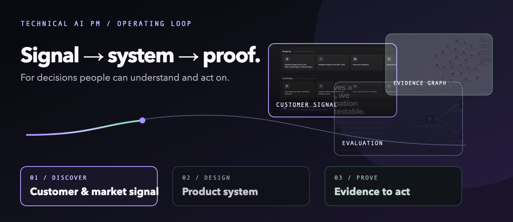
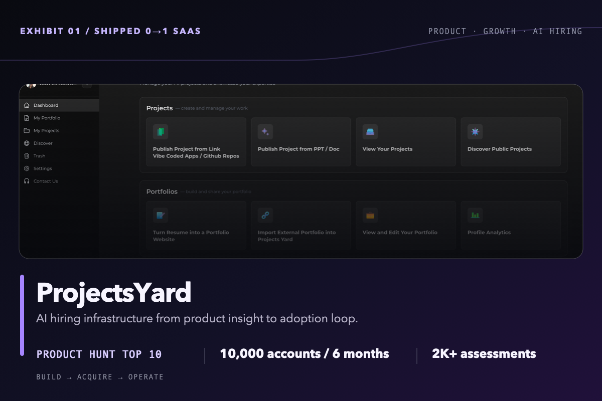
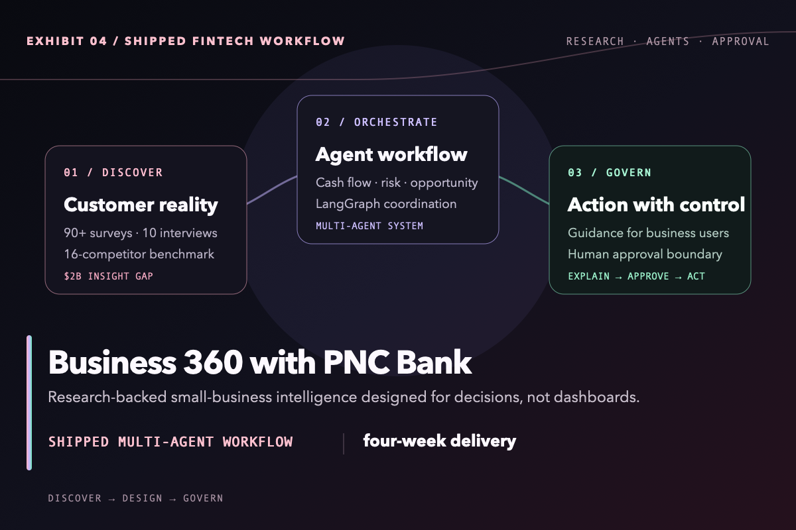
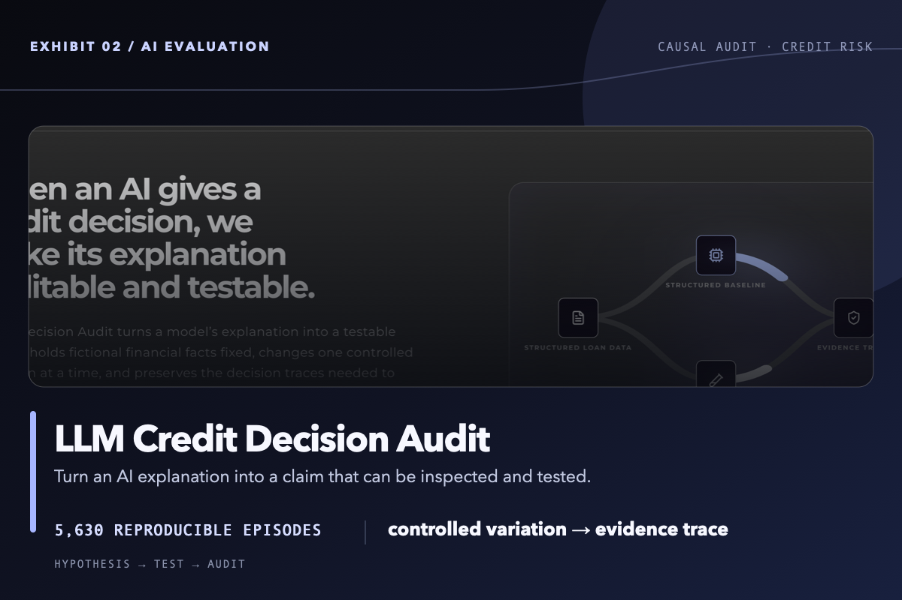
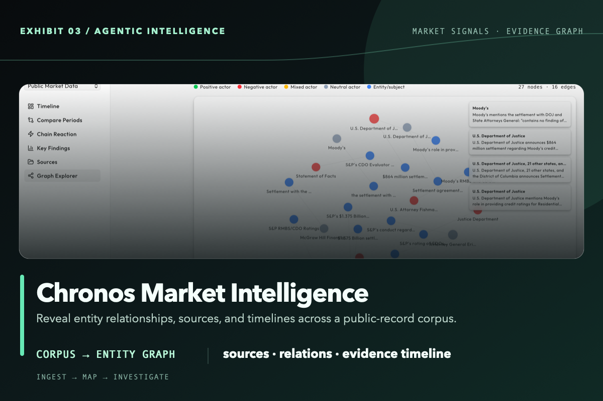

# Aditya Teja Bhimavarapu

**AI Product Manager | Builder, 0-to-1 SaaS, AI Patents (Pending), Product Growth, AI Evals, Finance Experience**

I built AI products for decisions that matter: like how a small business acts on Cash Flow Insights from AI, who gets hired in the age of AI drafted resumes & whether an AI-supported credit decision can be explained. 
with deep technical depth in LLMs, RAG, model fine-tuning, multi-agent workflows, evaluation harnesses, Python, SQL and Java
My work connects customer research, product strategy, and hands-on systems design with 5+ years of experience as a Founder, Manager and Senior Analyst. 

  

## Work that stands up to inspection

<table>
  <tr>
    <td width="50%" valign="top">
      
       
      <strong><a href="https://github.com/a-bhimava/projectsyard">Inspect ProjectsYard →</a></strong>
    </td>
    <td width="50%" valign="top">
      
       
      <strong><a href="https://github.com/a-bhimava/PNC-Business-360">Inspect Business 360 →</a></strong>
    </td>
  </tr>
  <tr>
    <td width="50%" valign="top">
      
       
      <strong><a href="https://github.com/a-bhimava/llm-credit-decision-audit">Inspect Credit Decision Audit →</a></strong>
    </td>
    <td width="50%" valign="top">
      
       
      <strong>Chronos Market Intelligence</strong> · visual case study
    </td>
  </tr>
</table>

## Connect

[LinkedIn](https://linkedin.com/in/aditya-teja) · [Portfolio](https://www.projectsyard.com/portfolio/adityatejabh) · [Email](mailto:adityatejabh@gmail.com)
