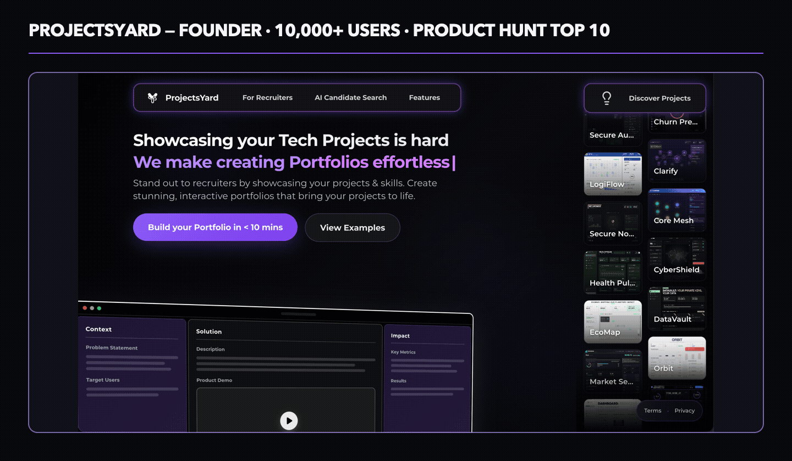

# Aditya Teja Bhimavarapu

**AI Product Manager | Builder, 0-to-1 SaaS, AI Patents (Pending), Product Growth, AI Evals, Finance Experience**

I built AI products for decisions that matter: like how a small business acts on Cash Flow Insights from AI, who gets hired in the age of AI drafted resumes & whether an AI-supported credit decision can be explained. 
with deep technical depth in LLMs, RAG, model fine-tuning, multi-agent workflows, evaluation harnesses, Python, SQL and Java
My work connects customer research, product strategy, and hands-on systems design with 5+ years of experience as a Founder, Manager and Senior Analyst. 

  

## Connect

[LinkedIn](https://linkedin.com/in/aditya-teja) · [Portfolio](https://www.projectsyard.com/portfolio/adityatejabh) · [Email](mailto:adityatejabh@gmail.com)
