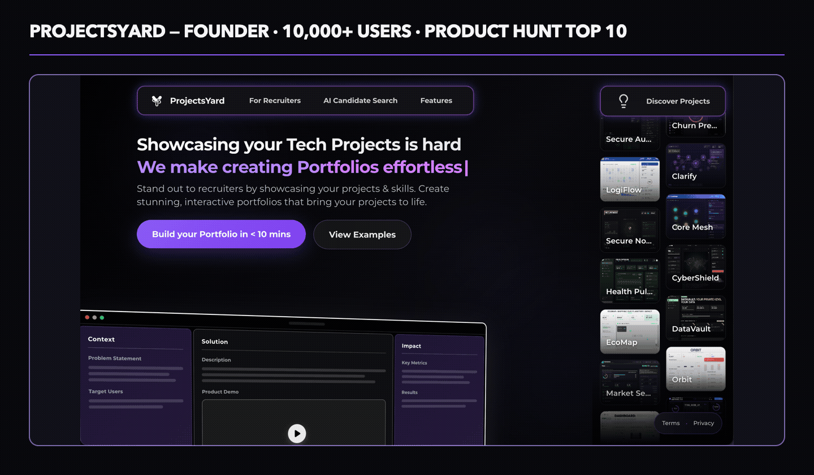

#### Aditya Teja Bhimavarapu <small>· AI Product Manager · Carnegie Mellon ·MBA· 5+ Years Exp in Product, Machine Learning & Finance</small>

<table>
  <thead>
    <tr>
      <th width="24%">Expertise</th>
      <th width="54%">Skills</th>
      <th width="22%">Work</th>
    </tr>
  </thead>
  <tbody>
    <tr>
      <td><strong>Product Management &amp; Growth</strong></td>
      <td>0→1 strategy · roadmaps, PRDs &amp; prioritization · customer discovery / JTBD · user stories &amp; experiment design · product analytics, KPIs / OKRs · GTM, pricing &amp; pilots</td>
      <td><a href="https://github.com/a-bhimava/projectsyard">ProjectsYard</a> · <a href="https://github.com/a-bhimava/PNC-Business-360">Business 360</a></td>
    </tr>
    <tr>
      <td><strong>AI Product Systems &amp; Safety</strong></td>
      <td>LLM / GenAI product design · RAG (hybrid search, embeddings) · AI agents (LangGraph, Bedrock) · MCP &amp; tool calling · eval harnesses, guardrails &amp; model observability</td>
      <td><a href="https://github.com/a-bhimava/PNC-Business-360">Business 360</a> · <a href="https://github.com/a-bhimava/llm-credit-decision-audit">Credit Decision Audit</a> · <a href="https://github.com/a-bhimava/Project-Chronos">Chronos</a></td>
    </tr>
    <tr>
      <td><strong>AI / ML &amp; Analytics</strong></td>
      <td>Python, SQL &amp; TypeScript · XGBoost, feature engineering &amp; Spark / PySpark · data modeling &amp; ETL · retrieval quality &amp; error analysis · Amplitude / Google Analytics · cost &amp; latency analysis</td>
      <td><a href="https://github.com/a-bhimava/PNC-Business-360">Business 360</a> · <a href="https://github.com/a-bhimava/projectsyard">ProjectsYard</a></td>
    </tr>
    <tr>
      <td><strong>Technical Delivery</strong></td>
      <td>Solution architecture · enterprise integrations · FastAPI, REST APIs &amp; webhooks · Docker &amp; CI/CD · AWS deployment</td>
      <td><a href="./Aditya_Resume_CMU_MS+MBA.pdf">ICICI Bank</a> · <a href="./Aditya_Resume_CMU_MS+MBA.pdf">Capgemini</a> · <a href="https://github.com/a-bhimava/Project-Chronos">Chronos</a></td>
    </tr>
    <tr>
      <td><strong>Enterprise Fintech &amp; Leadership</strong></td>
      <td>B2B SaaS &amp; fintech · regulated AI · data governance, security reviews &amp; threat modeling · credit / risk workflows · stakeholder management · cross-functional leadership &amp; change management</td>
      <td><a href="./Aditya_Resume_CMU_MS+MBA.pdf">PNC Bank</a> · <a href="./Aditya_Resume_CMU_MS+MBA.pdf">ICICI Bank</a> · <a href="./Aditya_Resume_CMU_MS+MBA.pdf">Capgemini</a> · <a href="https://github.com/a-bhimava/projectsyard">ProjectsYard</a></td>
    </tr>
  </tbody>
</table>

  

  
  
  

  
  
  

